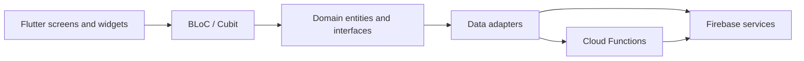

# ChillGo

> Good company. Easy meetups. Better days.

ChillGo is a crew-first meetup planner built with Flutter and Firebase. It gives
friends one shared place to create a crew, organize an outing, agree on the
details, chat, and coordinate while everyone is on the way.

**Project status:** active development and production-readiness work. Android
and iOS are the first public-release targets; Web and Windows remain supported
for development but are not part of the first store release.

## What the app does

- **Profiles and sign-in** — Google and Apple authentication, unique usernames,
  profile onboarding, and avatar uploads.
- **Crews** — create a group, invite friends by username, manage members, and
  keep invitations in one place.
- **Outings** — create, review, edit, cancel, and move an outing through its
  planning lifecycle.
- **Group agreement** — collect attendance responses, propose times and places,
  cast sealed ballots, and let the organizer confirm the result.
- **Outing chat** — participant-only real-time chat with unread state, retry
  handling, rate limits, and short-lived message retention.
- **Live Meetup** — arrival statuses, a shared meetup point, an accessible text
  alternative to the map, and opt-in foreground location sharing.
- **Notifications** — invitation and outing activity alerts. The broader private
  notification center and device-alert delivery are part of the current work.

ChillGo is intentionally **crew-first**: it is designed for coordinating a real
group and a real outing, not for building a public social feed.

## How a typical outing works

1. Sign in and create a ChillGo profile.
2. Create a crew and invite friends by username.
3. Add an outing and its participants.
4. Collect attendance, time, and location proposals.
5. Vote and confirm the agreed plan.
6. Use the outing chat before the meetup.
7. During the meetup, share arrival statuses and optional live location.

## Tech stack

| Layer | Technology |
| --- | --- |
| Client | Flutter 3.44.x, Dart 3.12.x |
| State and navigation | `flutter_bloc`, `go_router` |
| Dependency injection | `get_it` |
| Backend | Firebase Auth, Firestore, Storage, Cloud Functions, Messaging, App Check |
| Maps and location | Google Maps, Places/Geocoding proxies, `geolocator` |
| Server code | TypeScript 5.8 on Node.js 22 |
| Quality | Flutter tests, Mocha, Firebase Emulator Suite, GitHub Actions |

## Architecture

The Flutter client uses a feature-first Clean Architecture layout. UI state is
handled by BLoCs/Cubits, business rules live in the domain layer, and Firebase
details stay behind repository and service interfaces.



Sensitive operations such as sealed voting, chat commands, live-location
transitions, and cleanup are revalidated by Firestore Rules and trusted backend
code rather than relying only on the client.

```text
lib/
├── core/                   # DI, routing, errors, theme, shared UI
└── features/               # Feature-specific data/domain/presentation layers
    ├── authentication/
    ├── profile/
    ├── crews/
    ├── outings/
    ├── voting/
    ├── chat/
    ├── live_meetup/
    └── notifications/
functions/                  # TypeScript Firebase Cloud Functions
test/                       # Flutter unit and widget tests
integration_test/           # End-to-end Flutter journeys
firestore_tests/            # Firestore and Storage Rules tests
specs/                      # Feature specifications and implementation plans
docs/release/               # Security, privacy, support, and release runbooks
```

## Getting started

### Prerequisites

- [Flutter](https://docs.flutter.dev/get-started/install) 3.44.x with Dart
  3.12.x
- Node.js 22 and npm
- Java 21 and the Android SDK for Android development
- macOS with Xcode for iOS development
- [Firebase CLI](https://firebase.google.com/docs/cli) and
  [FlutterFire CLI](https://firebase.google.com/docs/flutter/setup)
- A Firebase project you control

### 1. Install dependencies

```sh
flutter pub get
npm --prefix functions ci
npm --prefix firestore_tests ci
```

### 2. Configure Firebase

Production Firebase client configuration is intentionally excluded from this
repository. Configure the app against your own Firebase project:

```sh
flutterfire configure
git restore firebase.json
```

`flutterfire configure` must create these ignored local files:

- `lib/firebase_options.dart`
- `android/app/google-services.json`
- `ios/Runner/GoogleService-Info.plist` when configuring iOS

The final `git restore` keeps the repository's provider-neutral emulator and
deployment settings after FlutterFire records local app IDs. The adjacent
`.example` files contain non-production placeholders for CI compilation only;
they do not connect to a usable backend.

Enable the Firebase products used by the app in your project: Authentication
(Google and Apple as needed), Firestore, Storage, Functions, App Check,
Messaging, Analytics, and Crashlytics.

### 3. Configure Google Maps

Create these ignored files for the mobile Maps SDK keys:

`android/maps-secrets.properties`

```properties
GOOGLE_MAPS_ANDROID_SDK_API_KEY=your_android_key
```

`ios/Flutter/GoogleMapsSecrets.xcconfig`

```text
GOOGLE_MAPS_IOS_SDK_API_KEY=your_ios_key
```

Use platform restrictions on both client keys. Places and Geocoding keys belong
in Firebase Secret Manager, never in the Flutter app. See the
[Live Meetup quickstart](specs/006-live-meetup/quickstart.md) for the complete
Maps, secret, and permission setup.

### 4. Run the app

```sh
flutter devices
flutter run -d <device-id>
```

## Using Firebase emulators

Build the Functions package, then start the local services:

```sh
npm --prefix functions run build
firebase emulators:start --only auth,firestore,functions,storage
```

In another terminal, launch ChillGo with emulator connections enabled:

```sh
flutter run --dart-define=USE_FIREBASE_EMULATORS=true
```

The app automatically uses `10.0.2.2` from an Android emulator and
`127.0.0.1` on other supported local targets.

## Tests and quality checks

Run the main validation suites before opening a pull request:

```sh
flutter analyze
flutter test
npm --prefix functions test
npm --prefix firestore_tests test
```

The repository also includes Android/iOS integration tests, performance
harnesses, security validation matrices, and a two-pass release validator:

```sh
dart run tool/run_release_validation.dart
```

See the [release validation guide](specs/008-production-readiness/quickstart.md)
for environment requirements and the full candidate process.

## Privacy and security notes

- Crew, outing, vote, chat, notification, and live-meetup data is protected by
  Firebase authorization rules and backend access checks.
- Chat content is intentionally short-lived, with a 24-hour supported-client
  visibility boundary and backend cleanup.
- Live location is opt-in, foreground-only, and short-lived; it stops when the
  session or participant eligibility ends.
- Analytics and crash reports must not contain private product content.
- Service accounts, signing material, API keys, store credentials, and user
  evidence must never be committed.

For more detail, read the [privacy policy](docs/release/privacy-policy.md),
[security validation matrix](docs/release/security-validation-matrix.md), and
[environment and secrets guide](docs/release/environment-and-secrets.md).

## Project documentation

- [Production-readiness plan](specs/008-production-readiness/plan.md)
- [Feature specifications](specs/)
- [Release operations](docs/release/README.md)
- [Support guide](docs/release/support.md)
- [Firestore data lifecycle](docs/firestore-data-lifecycle.md)

## Contributing

Issues and pull requests are welcome. Keep changes inside the existing
feature-first boundaries, add tests for behavior changes, and run the quality
checks above before submitting. Never include production secrets or private user
data in code, fixtures, logs, screenshots, or release evidence.
