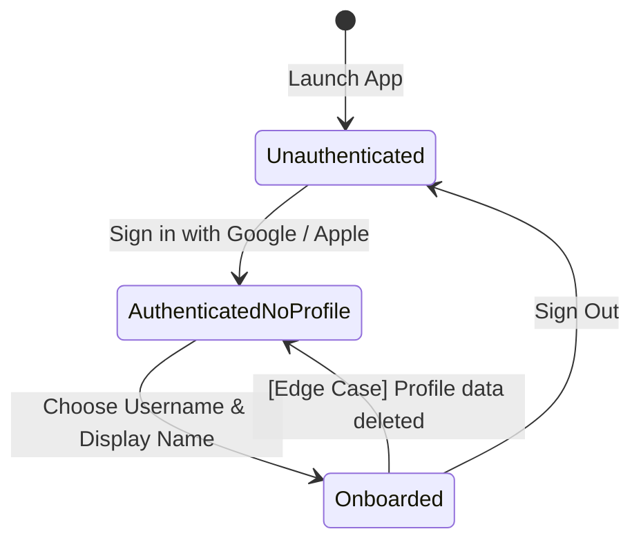

# Data Model: Phase 1 — Authentication & Profiles

## Entities

### UserProfile

Represents the core profile information of an onboarded ChillGo user.

#### Fields

| Field Name | Type | Description | Constraints |
|:---|:---|:---|:---|
| `id` | String | Unique user ID generated by the auth provider | Immutable |
| `username` | String | Unique username chosen by the user | Immutable, lowercase, alphanumeric + underscores, 3-20 chars |
| `displayName` | String | Display name chosen by the user | Mutable, non-empty, 1-50 chars |
| `avatarUrl` | String? | Remote URL pointing to the user's custom profile avatar | Mutable, optional |
| `createdAt` | DateTime | Timestamp of profile registration | Immutable |

#### State Transitions



---

## Database Schemas (Cloud Firestore)

### `users` Collection
- **Path**: `/users/{uid}`
- **Document Structure**:
  ```json
  {
    "username": "john_doe",
    "displayName": "John Doe",
    "avatarUrl": "https://firebasestorage.googleapis.com/.../avatars%2Fuid.jpg",
    "createdAt": "2026-06-29T16:15:00.000Z"
  }
  ```

### `usernames` Collection
- **Path**: `/usernames/{username_lowercase}`
- **Document Structure**:
  ```json
  {
    "uid": "user_firebase_uid_here"
  }
  ```

---

## Storage Schemas (Firebase Storage)

### `avatars` Directory
- **Path**: `/avatars/{uid}`
- **Content**: User profile image file (JPEG or PNG, max 500 KB, compressed).

---

## Security Rules

### Firestore Security Rules
```javascript
rules_version = '2';
service cloud.firestore {
  match /databases/{database}/documents {
    
    // User Profile Rules
    match /users/{uid} {
      allow read: if request.auth != null;
      allow create: if request.auth != null && request.auth.uid == uid;
      allow update: if request.auth != null && request.auth.uid == uid;
      allow delete: if false; // Profiles cannot be deleted directly from client in MVP
    }
    
    // Username Registry Rules (Ensures Uniqueness)
    match /usernames/{username} {
      allow read: if request.auth != null;
      allow create: if request.auth != null && request.resource.data.uid == request.auth.uid;
      allow update, delete: if false; // Usernames are immutable
    }
  }
}
```

### Storage Security Rules
```javascript
rules_version = '2';
service firebase.storage {
  match /b/{bucket}/o {
    match /avatars/{uid} {
      allow read: if request.auth != null;
      allow write: if request.auth != null 
                   && request.auth.uid == uid 
                   && request.resource.size < 512 * 1024 // Limit to 500 KB
                   && request.resource.contentType.matches('image/.*');
    }
  }
}
```
