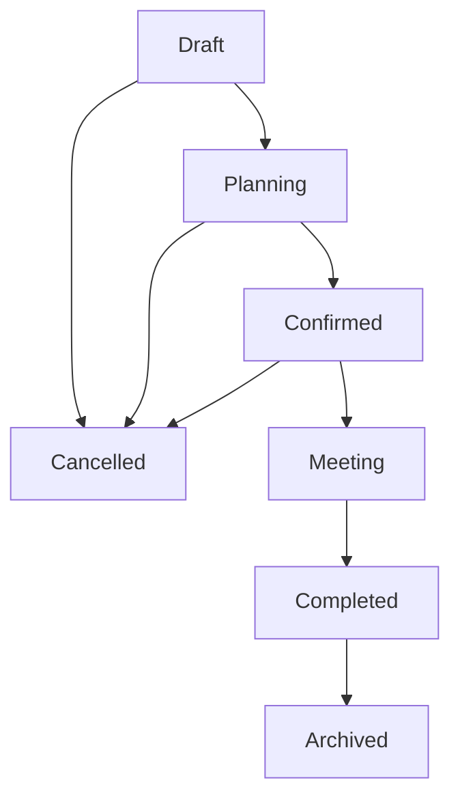
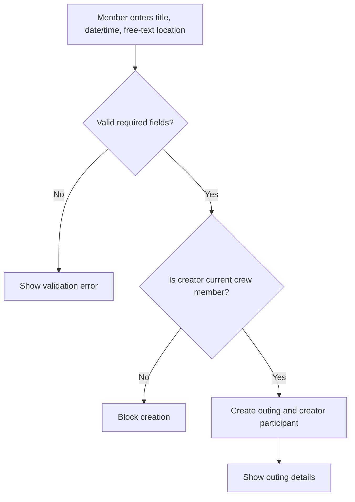
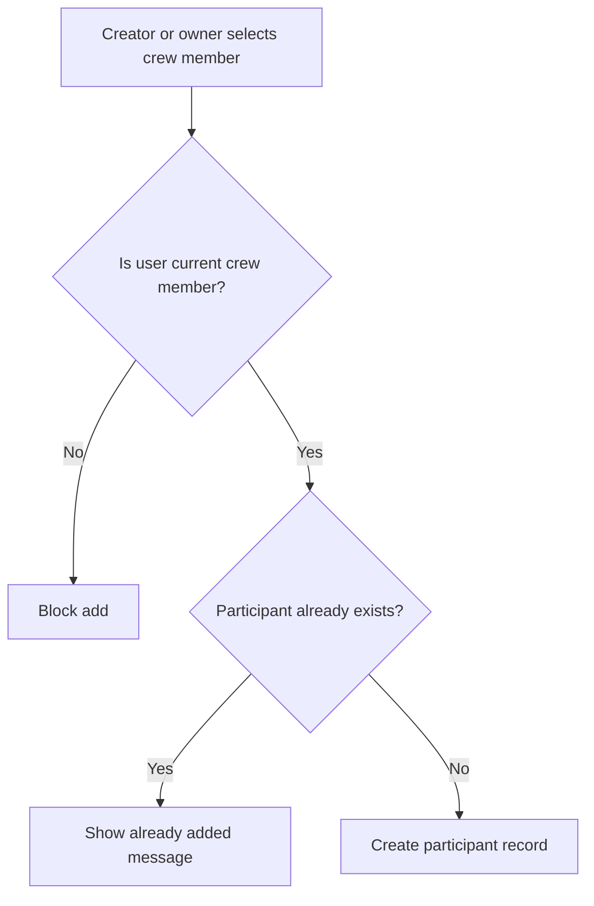
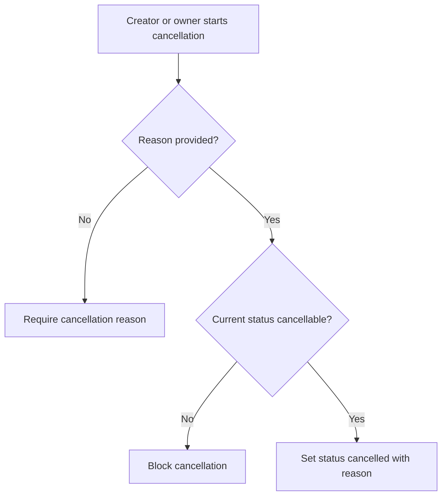

# Data Model: Outing Management

This document defines entities, field formats, relationships, validation rules, and lifecycle behavior for Phase 3: Outing Management.

## Entities

### 1. Outing

Represents an event organized within a crew.

- **Path**: `/outings/{outingId}`
- **ID**: Firestore auto-generated string

| Field Name | Type | Description |
|------------|------|-------------|
| `id` | String | Unique outing identifier |
| `crewId` | String | Crew that owns the outing |
| `title` | String | Outing title |
| `description` | String (nullable) | Optional outing description |
| `scheduledAt` | String | Canonical ISO 8601 UTC timestamp for the outing date and time |
| `locationText` | String | Free-text location only |
| `status` | String | One of `draft`, `planning`, `confirmed`, `meeting`, `completed`, `archived`, `cancelled` |
| `createdByUserId` | String | UID of the outing creator |
| `createdAt` | String | Canonical ISO 8601 UTC timestamp of creation |
| `updatedAt` | String | Canonical ISO 8601 UTC timestamp of last update |
| `cancelledReason` | String (nullable) | Required when status is `cancelled` |
| `cancelledAt` | String (nullable) | Canonical ISO 8601 UTC timestamp of cancellation |
| `archivedAt` | String (nullable) | Canonical ISO 8601 UTC timestamp of archive |

#### Validation Rules

- `crewId` MUST reference an existing crew.
- `createdByUserId` MUST be a current member of `crewId` at creation time.
- `title` MUST be trimmed and between 3 and 80 characters.
- `description`, when present, MUST be trimmed and no longer than 500 characters.
- `scheduledAt` MUST represent a future date/time for active outing creation and active schedule edits.
- `locationText` MUST be trimmed and between 1 and 120 characters.
- `status` MUST be one of the supported lifecycle statuses.
- New outings MUST start with `status` set to `draft`.
- `cancelledReason` MUST be present, trimmed, and between 3 and 200 characters when `status` is `cancelled`.
- Planning details MUST NOT be edited when `status` is `cancelled`, `completed`, or `archived`.
- `archivedAt` MUST be set when `status` is `archived`.
- Timestamp strings MUST use UTC with fixed millisecond precision (`yyyy-MM-ddTHH:mm:ss.SSSZ`) so lexical ordering matches chronological ordering.

---

### 2. Outing Participant

Represents a crew member included in a specific outing roster.

- **Path**: `/outing_participants/{outingId}_{userId}`
- **ID**: Predictable string format: `${outingId}_${userId}`

| Field Name | Type | Description |
|------------|------|-------------|
| `id` | String | Unique identifier (`outingId_userId`) |
| `outingId` | String | Outing identifier |
| `crewId` | String | Crew that owns the outing |
| `userId` | String | UID of the participant |
| `username` | String | Cached username for roster display |
| `displayName` | String | Cached display name for roster display |
| `avatarUrl` | String (nullable) | Cached avatar URL for roster display |
| `addedByUserId` | String | UID of the creator or manager who added this participant |
| `addedAt` | String | Canonical ISO 8601 UTC timestamp of participant creation |
| `isCreatorParticipant` | Boolean | Whether this record was automatically created for the outing creator |

#### Validation Rules

- `id` MUST equal `${outingId}_${userId}`.
- `outingId` MUST reference an existing outing.
- `crewId` MUST match the outing's `crewId`.
- `userId` MUST be a current member of `crewId`.
- Duplicate participants are prevented by the predictable document ID.
- The creator participant record MUST be created with the outing.
- Participants MAY be removed from active outings before completion or archive by the outing creator or crew owner.
- Participant records MUST NOT be created for non-crew members.

---

### 3. Crew

Represents the persistent group that owns outings.

- **Existing Path**: `/crews/{crewId}`

#### Relationship Rules

- An outing MUST belong to exactly one crew.
- Only current members of the owning crew can read the outing.
- Crew owner permissions apply to outing management actions.

---

### 4. Crew Membership

Represents a user's current access to a crew.

- **Existing Path**: `/crew_memberships/{crewId}_{userId}`

#### Relationship Rules

- Crew membership determines outing visibility.
- Crew membership determines participant eligibility.
- If a user is removed from a crew, the user MUST lose access to that crew's outing details.

## State Transitions

### Outing Lifecycle

### Transition Rules

- Only the outing creator or crew owner can manually change lifecycle status.
- Invalid transitions MUST be rejected locally and by persisted-data validation.
- `cancelled` and `archived` are terminal statuses for planning edits.
- `completed` can only transition to `archived`.

## Workflows

### Create Outing

### Add Participant

### Cancel Outing

